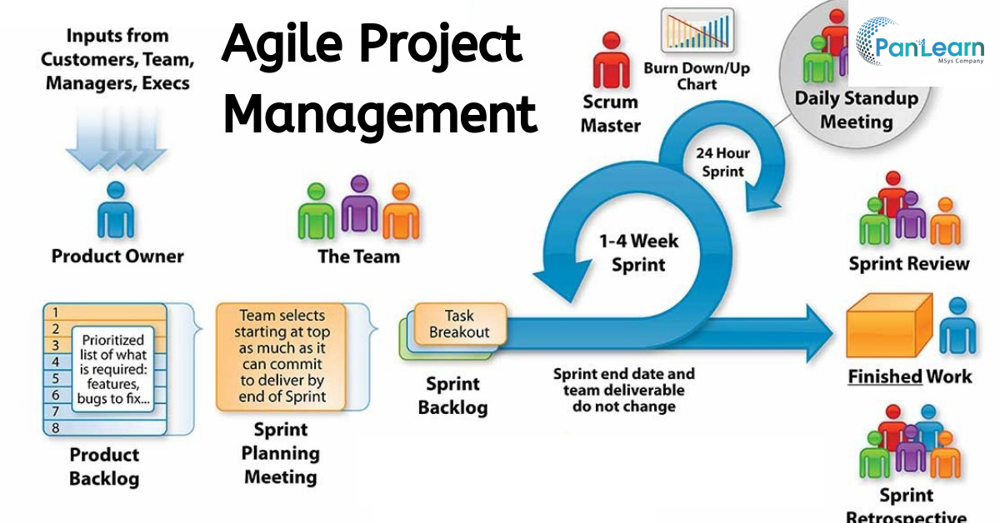

---

layout: essay

type: essay

title: Software Engineering, A Long Strange Trip

permalink: projects/long-strange-trip

# All dates must be YYYY-MM-DD format!

date: 2021-12-15

labels:

- User Interface Frameworks

- Github

- intelliJ

- Semantic UI with React

- Reactive Software Development

- testCafe Testing Implementation

- Agile Project Management

summary: My last and final reflections on ICS 314 and all of the software engineering concepts I stuffed into my brain during a 3 month period of time.

---

  

- [Intro](#a-well-organized-whirlwind)
- [Project Management](#agile-project-management)
- [Managing My Project](#managing-and-my-project)
- [Standards](#coding-standards)
- [UI Frameworks](#user-interface-frameworks)
- [Conclusion](#future-endeavors)

## A Well Organized Whirlwind

Covering 100's of thousands of miles of software engineering terrain was no easy feat, but was well worth it. I seem to enjoy things that produce as much as I put in. This class was definitely that. From [javaScript](https://nicholasbcarr.github.io/essays/fresh-thoughts.html), to [Coding Standards](https://nicholasbcarr.github.io/essays/the-art-of-coding.html), to an immense techStack, to developmental frameworks... I'm not sure how much more we could have done in the same amount of time. Frustrating things to me such as HTML and CSS started as a real pain, but slowly became a manageable pain that is easier to forget about. That is the beauty of practice is that it makes things seem less terrible. Anyways, there are some concepts that I picked up along the trail that is ICS 314 that are important and were new to me.

## Agile Project Management

  

The overall gist of Agile Project Management is that an owner or company will feed tasks, issues, and fixes for an app in progress or an app already built. These tasks then trickle down to the team members, where I found it was best to assign/choose tasks according to strengths as it freed up more time for improvement and saved others from wasting their own time. When everyone has their tasks they are kept organized by status, todo/in progress/done where it is visible to all the team members whom is assigned (or doing) what. This helped in asking questions about code as it was easy to determine who wrote it based on the issue they were assigned. At the end of each deadline, all the tasks and issues are reassessed and distributed to enhance the workflow of the app development process. This will be something I think will be good to utilize, especially when everyone is held accountable, for other software projects involving working teams.

## Managing and My Project

Agile Project management is a system of organization we learned to use and practiced as a team for our final project. This may have been the greatest challenge: working on a team is managing the work load, finding out who is best with what, and when everybody works or is free is a lot of information to stay on top of. I have said before that being a good team member requires just as much practice as being a good programmer but I believe my team did well as we were scaled down to a short amount of time with everyone being busy college students. There is always a balance and I dont believe there are many situations where any team has a perfect balance of work that gets divided, but in many aspects having a team was beneficial. Getting a taste of creating issues, tracking issues and getting things closed out as to not hinder someone else's progress was very challenging and even frustrating at times. This turned out to be a lesson in me trying to learn to trust others where in the past I was trained to trust but verify. In some aspects that is okay, but in the world of software engineering, the characteristic is often times negative as it is important to rely on your team members as certain things cannot be done by one person. Fortunately my team worked out and came through when most needed, but I will take these observations and lessons with me into the future.

## Coding Standards

On the topic of teamwork and project management, I feel like it would be a sin not to mention coding standards. It makes sense that these were covered early in the semester and makes even more sense that we learned it before the final project. I will put it this way, I do not even want to imagine what coding a team project would be like if there was no adherence to some form of base coding etiquette. As I tested the project, I never once had an issue wondering what someones code was saying or doing because we were all taught to conform and code to these coding standards, with ES Lint (code spell check) as a safety net. In previous classes where I worked individually, if one of my friends was stuck on something, I wouldn't be able to help them because I could not even understand their code. This is my shout out to coding standards.

## User Interface Frameworks

I am just going to go out on a limb here and compare frameworks to coding standards in that frameworks are more building standards (building blocks) or design standards. Frameworks were new to me and I didn't really get the purpose until we had learned the last one, [React (get started here)](https://react.semantic-ui.com/usage/), we needed for the semester. I will have to say that frameworks and coding standards are what allow software engineers to work as teams in the real world (my best guess). It gives the basic building blocks, patterns, and instructions where things can be developed differently but understandable to anyone familiar with the framework. This is great for team based app development and for people to get familiar with front end development all together. The tools to interact with the users are already available, the programmer gets to choose how to use them or implement them meaning everyone can have their style while maintaining readability across other developers.

## Future Endeavors

While I am ready for a nice relaxing break, I am happy with ICS 314 experience... so much that I am taking the follow up course. This is going to be a good opportunity to carry over all the lessons good and bad with me and actually get to apply the knowledge from my mistakes rather than it going dust in the wind. I hope to not only solidify my current knowledge but expand upon it and go deeper into it with hopefully more time. My first essay, [The Rookie Software Engineer](https://nicholasbcarr.github.io/essays/amateur-engineer.html), I discussed being a rookie noob... today I can probably say I am something beyond that.
