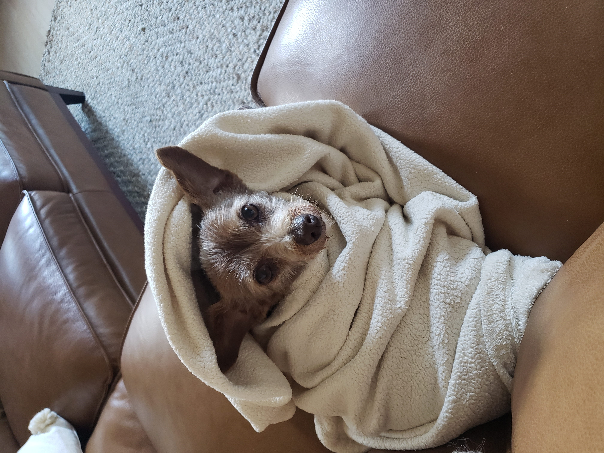

---

layout: essay

type: essay

title: The Rookie Software Engineer

# All dates must be YYYY-MM-DD format!

date: 2021-09-02

labels:

  - Software Engineering

  - Learning

  - javaScript

---

## The Rookie Software Engineer

Software engineering is interesting to me because I have always liked fixing things and making things. I didn’t always have a computer, but I think that interest carried over. I also always liked solving puzzles and playing games as well. I like the concept of being able to build something from the ground up and changing it along the way to fit new issues and problems that arise. Using the right data structures, functions and putting pieces together I think will be most of what software engineering is. 

### Getting Reps

The WOD’s seem to be a crucial part of developing my skill to solve problems quickly as they get me to practice up on the current material. I make sure I know my syntax, module information and go to all the practice problems so I can get the most out my short time learning javaScript and software engineering.  I hope to get a wide variety of new tools to experiment with, but I think another bonus will be getting a 3 month foundation in javaScript as well. 

#### Trying New Things

Working with Linux, meteor and intellij is also going to be a very new thing to me as well. I always like getting to know a good IDE and most importantly figure out how to debug with that IDE in specific. I think being able to pick up new things quickly is very important as that trait will be a huge part of getting a job after school. At this point, IDE’s are pretty similar to me but I know there are much more powerful ones than I have used. I am excited to get my feet wet with that to.

##### Online Professional Persona

Building my resume and professional portfolio will also be big areas of focus for me as I am new to the whole online resume/portfolio concept. It seems to be the standard now. This class will enable me to do some things as a part of the class that I would have had to done on my own at some point. I am extremely grateful for that.
