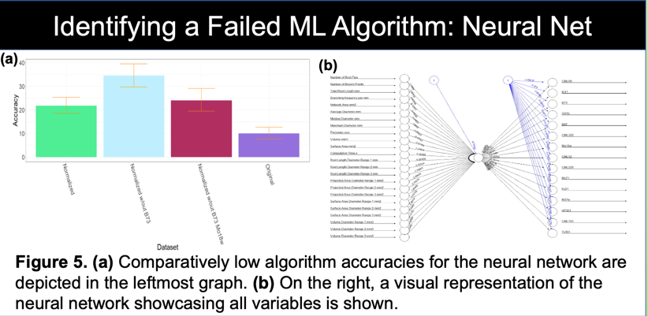
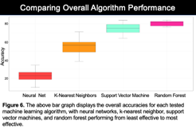

---

layout: essay

type: essay

title: Machine Learning and Agricultural Sustainability

# All dates must be YYYY-MM-DD format!

date: 2022-08-15

labels:

- Data Science

- R Program Language

- R Studio

- Agriculture

- Research

- Rhizovision

- Machine Learning

- Island Preservation

---

- [Intro](#improving-the-land)
- [Data Farming](#harvesting-the-data)
- [Variance](#determining-variance-across-inbreds)
- [Training the Machine Learning Algorithms](#feeding-the-machine)
- [Neural Networking with "Small Data"](#no-success-comes-without-failure)
- [The Final Result](#recommending-genotypes)
- [Click Me to View Project Page](https://uh-manoa-meteorites.github.io/)

## Improving the Land

The REEU experience was more than learning about new program languages and the science behind agricultural sustainability. Our cohort was fortunate to volunteer and aid food forest projects and help with planting sustainable agriculture projects. We also had the luxury of observing research projects aimed at restoring native plants while simultaneously expelling invasive agriculture and pests. Before this experience, I had never imagined a field in which computer science and conservation combined and hope that this was not my last chance to be involved. It is important to mention these bonus experiences before getting into the technical things. The research we monitored in action was heavily assisted by technology and the processing of large data sets. These field trips allowed us to see that the work we were doing in the lab was not just homework or projects, but necessary to push for food security and sustainability on a national level. Lastly, it was nice to have an in-person team of coworkers for the first time since covid-19.

  

## Harvesting the Data

In order to utilize machine learning algorithms, large amounts of training data are required. A unique part of this experience was that each member grew 24 plants of a specific genotype, mine was the standard, [B-73](https://academic.oup.com/plphys/article/156/4/1679/6108850). As a result, there were 12 inbred lines (in addition to data for 12 other inbreds from the previous summer) of maize in which 100's of data-points were collected over a three week growing period. Interestingly, a maize plant can be fully classified after it completes its growing of its fourth leaf. This inherent characteristic of maize allowed for meaningful data to be generated in a short period of time. Hawaii is used to test new genotypes for a wide set of agriculture because its environment is perfect for growing seeds year round. Upon full maturity of our plants, we dissected each one into root and shoot systems for multi-path research. ([jump to poster](#final-poster))

My research focus was on root system architecture meaning that I had to clean and scan all of the roots in order to generate the data I would later use to train my algorithms. Direct root system scans would have been a quicker to process, but the Rhizovison image processor allowed for quantification of the images into 120 data points per plant. Further separating root structures into primary, seminal, and crown roots resulted in more accurate classifications.

After tending my plants and measuring their leaves in a greenhouse, in the Hawaiian summer sun at noon every day, one could say I was ready to "harvest the data."

## Determining Variance Across Inbreds

Although the Rhizovision software converted root scans to a large number of data points, determining variance and visualizing the data was needed to guide our research. Principle component analysis is an automated way to achieve this. After scrubbing the data we fed it to a PCA function which not only determined the data fields with the highest variance but allowed for 2-d and 3-d cluster visualization. The PCA was paramount in tuning the algorithms we tested to get satisfactory results. It can be seen in the PCA model that there is very marginal separation between inbreds but still enough to tune the algorithms. PCA results were then fed to each of the four algorithms we tested. ([jump to poster](#final-poster))

PCA not only provided an input data set to the machine learning algorithms but also a path to rooting out highly confused genotypes to exclude in other runs. We tested this by feeding the PCA/terminal data (unmodified) to each algorithm, piping the output to a confusion matrix, then visually comparing highly confused genotypes to minimal variance components. There was usually a correlation however, not always.

Together, 8 data sets were prepared using both PCA results and the terminal data set as follows:

1. Terminal data (no cleaning)
2. Terminal data, 1st highest confused removed
3. Terminal data, 1st and 2nd highest confused removed
4. Terminal data, 1st, 2nd, and 3rd highest confused removed
5. PCA output (unmodified)
6. PCA output, 1st highest confused removed
7. PCA output, 1st and 2nd highest confused removed
8. PCA output, 1st, 2nd, and 3rd highest confused removed

## Feeding the Machine

The four algorithms I tested were K Nearest Neighbors, Support Vector Machine, Random Forest, and neural network. The poster shows a graph that rates each machine learning models performance on each of the 8 data sets and a confusion matrix for its best performance. At this point we were not only trying to accurately classify genotypes by root system but also make our own predictions on how each model would perform given the data set. Although seperated clusters of data are ideal for all situations, these clusters are remain more important for SVM and KNN algorithms. In short, these algorithms can make decisions by associating a cluster of data to its nearest cluster. What makes this extremely powerful is that the math can be done with almost infinite dimensions, impossible to do as a human. In our case, we had 32 dimensions (32 columns in an excel spreadsheet) of terminal data. ([jump to poster](#final-poster))

Examples of data points: root surface area, root length, root diameter, root type (crown, seminal, primary)...

K-Nearest Neighbors (KNN) does exactly as its name suggests. A finite K value is used to make its final decision. The data is either an individual point, or a cluster of points representing an "object" in space. Using distance, the algorithm determines the k nearest neighbors to the point and weighs their distance to their class. "Averaging" all of this data gives the most likely class of object as decided by the machine model. PCA data with the three most overlapping clusters removed was obviously the best set of data for this algorithm.

Support Vector Machines (SVM) use functions to separate objects in space. The model classifies objects within the bounds of the chosen function to be of the same. The error is determined by finding which objects in the bounds that are the wrong class. I used a polynomial of factor 6 for separation, and as expected the PCA data with the most similar classes removed showcased the best SVM performance. It would be interesting to come back to this after a linear algebra course and see how much this could be improved.

Random Forest (RF) is different in that it builds decision trees in which its leaves are the classifications or genotypes for our purposes. I originally thought that random forest would operate best with the PCA data but the computational power of a decision tree is almost unimaginable. It performed best with terminal data where the genotypes removed were the ones it confused most from the terminal data set. The difference between the terminal data and PCA output is that the later is broken into 10 components in which 95% of the variance is explained and the first had all data points. We hypothesize that it is more difficult to over-fit a random forest than it is for SVM or KNN.

## No Success Comes without Failure

Training neural networks is difficult and time consuming to say the least. Neural nets also perform better as more data is processed. Although our data set was large in human eyes, there would need to be quite a bit more to make it "useful" setting one up. We are displaying ours as we put in quite a bit of effort for only a 25% accurate classification rating. The term "black box" is thrown around a lot in the machine learning industry and it means that after initial training, nobody can prove how or why the network behaves as it does (a generalization).

## Modeling the Models

To compare performance of the different algorithms, I piped portions of each algorithms output into another model that visualizes performance and error between the 4. This project showed me the true power of data visualization. Looking at the raw output of different functions is mind-numbing and requires a deeper understanding to sort. Modeling the data into something visually aesthetic also makes the punch-line easier for everybody (experts and non-experts) to understand.

Having an array of opportunity IDs attached to each organization in the organization collection would have been much easier. For filtering the volunteer opportunities by interest, skill or environment type it would have been better to attach the applicable IDs to the opportunity document. Our implementation worked just fine but if I am ever part of up-scaling the project further I would redesign the collections as finding data would become slow as more opportunities are added.

## Recommending Genotypes

The machine learning and training was fun and very important to see as a computer science undergrad but all of this research had to have a purpose. Getting a crash course in soil and root biology, we found that we could accurately tune our models to recommend optimal inbreds based on soil physicality. As soil is varies in depth and firmness across the globe, all one needs to know is the parameters of their soil to get pinpoint selection of optimal genotype. Again, this is easier to understand by looking at the graphical model.

## Final Poster

  

