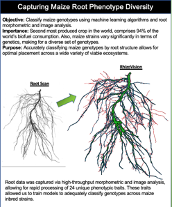
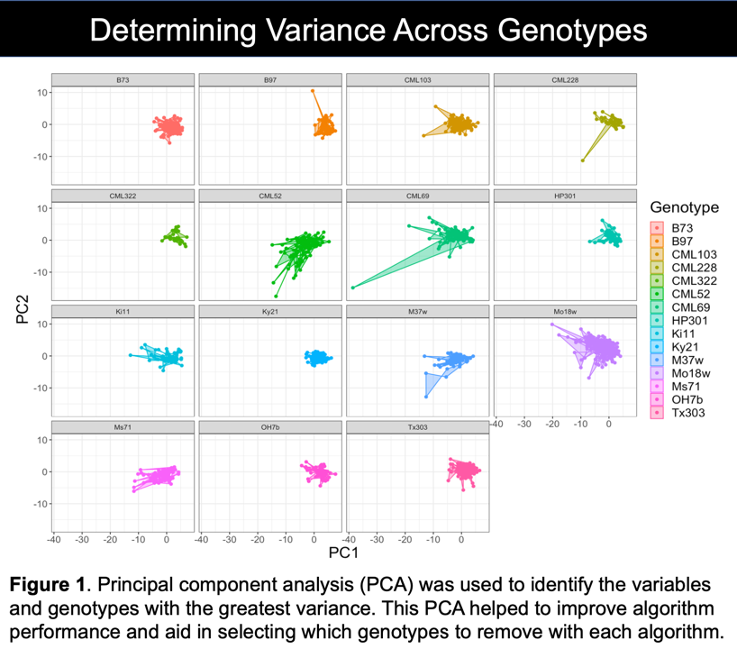
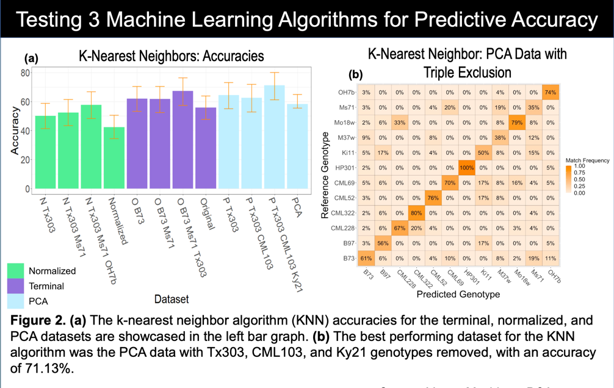
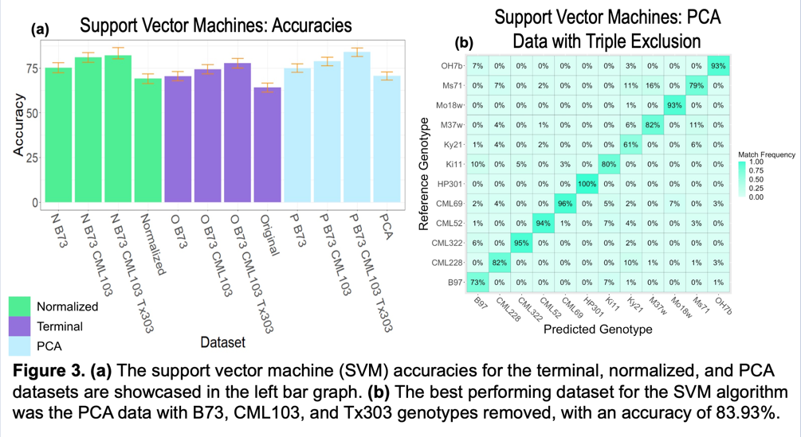
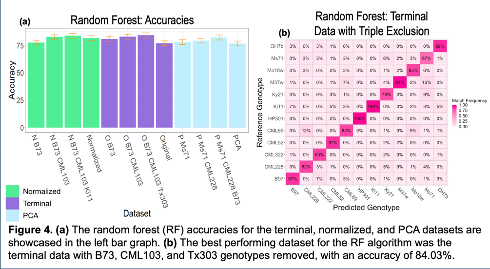
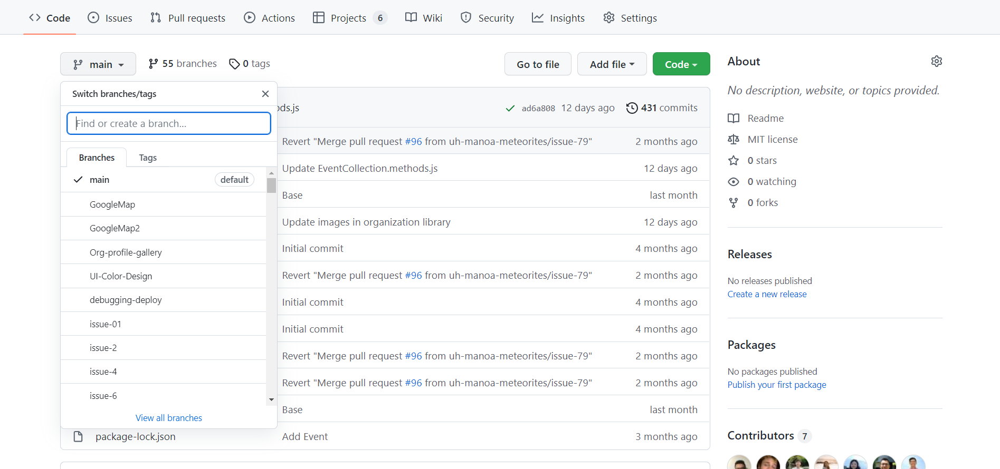
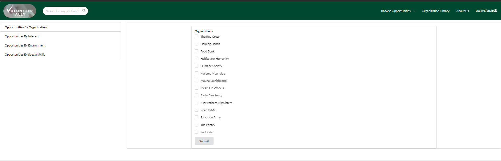
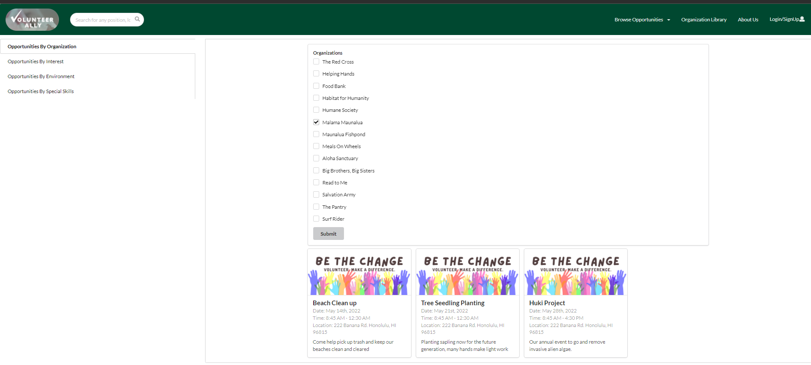

---

layout: essay

type: essay

title: Machine Learning and Agricultural Sustainability

# All dates must be YYYY-MM-DD format!

date: 2022-08-15

labels:

- Data Science

- R Program Language

- R Studio

- Agriculture

- Research

- Rhizovision

- Machine Learning

- Island Preservation

---

- [Intro](#improving-the-land)
- [Data Farming](#harvesting-the-data)
- [Variance](#determining-variance-across-inbreds)
- [Training the Machine Learning Algorithms](#feeding-the-machine)
- [Github](#github)
- [Filtering Collections](#filtering-collections)
- [Human to Human Communications](#human-to-human-interfacing)
- [Customer Expectations](#customer-expectations)
- [The Final Result](#recommending-genotypes)
- [Click Me to View Project Page](https://uh-manoa-meteorites.github.io/)


## Improving the Land

The REEU experience was more than learning about new program languages and the science behind agricultural sustainability. Our cohort was fortunate to volunteer and aid food forest projects and help with planting sustainable agriculture projects. We also had the luxury of observing research projects aimed at restoring native plants while simultaneously expelling invasive agriculture and pests. Before this experience, I had never imagined a field in which computer science and conservation combined and hope that this was not my last chance to be involved. It is important to mention these bonus experiences before getting into the technical things. The research we monitored in action was heavily assisted by technology and the processing of large data sets. These field trips allowed us to see that the work we were doing in the lab was not just homework or projects, but necessary to push for food security and sustainability on a national level. Lastly, it was nice to have an in-person team of coworkers for the first time since covid-19.

<div class="ui medium images">

  

</div>

## Harvesting the Data



In order to utilize machine learning algorithms, large amounts of training data are required. A unique part of this experience was that each member grew 24 plants of a specific genotype, mine was the standard, [B-73](https://academic.oup.com/plphys/article/156/4/1679/6108850). As a result, there were 12 inbred lines (in addition to data for 12 other inbreds from the previous summer) of maize in which 100's of data-points were collected over a three week growing period. Interestingly, a maize plant can be fully classified after it completes its growing of its fourth leaf. This inherent characteristic of maize allowed for meaningful data to be generated in a short period of time. Hawaii is used to test new genotypes for a wide set of agriculture because its environment is perfect for growing seeds year round. Upon full maturity of our plants, we dissected each one into root and shoot systems for multi-path research. ([jump to poster](#final-poster))

My research focus was on root system architecture meaning that I had to clean and scan all of the roots in order to generate the data I would later use to train my algorithms. Direct root system scans would have been a quicker to process, but the Rhizovison image processor allowed for quantification of the images into 120 data points per plant. Further separating root structures into primary, seminal, and crown roots resulted in more accurate classifications.

After tending my plants and measuring their leaves in a greenhouse, in the Hawaiian summer sun at noon every day, one could say I was ready to "harvest the data."

## Determining Variance Across Inbreds



Although the Rhizovision software converted root scans to a large number of data points, determining variance and visualizing the data was needed to guide our research. Principle component analysis is an automated way to achieve this. After scrubbing the data we fed it to a PCA function which not only determined the data fields with the highest variance but allowed for 2-d and 3-d cluster visualization. The PCA was paramount in tuning the algorithms we tested to get satisfactory results. It can be seen in the PCA model that there is very marginal separation between inbreds but still enough to tune the algorithms. PCA results were then fed to each of the four algorithms we tested. ([jump to poster](#final-poster))

PCA not only provided an input data set to the machine learning algorithms but also a path to rooting out highly confused genotypes to exclude in other runs. We tested this by feeding the PCA/terminal data (unmodified) to each algorithm, piping the output to a confusion matrix, then visually comparing highly confused genotypes to minimal variance components. There was usually a correlation however, not always.

Together, 8 data sets were prepared using both PCA results and the terminal data set as follows:

1. Terminal data (no cleaning)
2. Terminal data, 1st highest confused removed
3. Terminal data, 1st and 2nd highest confused removed
4. Terminal data, 1st, 2nd, and 3rd highest confused removed
5. PCA output (unmodified)
6. PCA output, 1st highest confused removed
7. PCA output, 1st and 2nd highest confused removed
8. PCA output, 1st, 2nd, and 3rd highest confused removed

## Feeding the Machine

The four algorithms I tested were K Nearest Neighbors, Support Vector Machine, Random Forest, and neural network. The poster shows a graph that rates each machine learning models performance on each of the 8 data sets and a confusion matrix for its best performance. At this point we were not only trying to accurately classify genotypes by root system but also make our own predictions on how each model would perform given the data set. Although seperated clusters of data are ideal for all situations, these clusters are remain more important for SVM and KNN algorithms. In short, these algorithms can make decisions by associating a cluster of data to its nearest cluster. What makes this extremely powerful is that the math can be done with almost infinite dimensions, impossible to do as a human. In our case, we had 32 dimensions (32 columns in an excel spreadsheet) of terminal data. ([jump to poster](#final-poster))



K-Nearest Neighbors (KNN) does exactly as its name suggests. A finite K value is used to make its final decision. The data is either an individual point, or a cluster of points representing an "object" in space. Using distance, the algorithm determines the k nearest neighbors to the point and weighs their distance to their class. "Averaging" all of this data gives the most likely class of object as decided by the machine model. PCA data with the three most overlapping clusters removed was obviously the best set of data for this algorithm.



Support Vector Machines (SVM) use functions to separate objects in space. The model classifies objects within the bounds of the chosen function to be of the same. The error is determined by finding which objects in the bounds that are the wrong class. I used a polynomial of factor 6 for separation, and as expected the PCA data with the most similar classes removed showcased the best SVM performance. It would be interesting to come back to this after a linear algebra course and see how much this could be improved.



Random Forest (RF) is 

## Github

Learning to use github has been quite a treat. It is not fool proof, but being able to preserve the state of the working application saved my team on multiple occasions. This project had numerous moving pieces making it difficult to determine when and where new code might affect something unrecognized to that team member. All in all, Github allows for team members to work on tasks simultaneously when correctly using Github thus allowing for Agile Project Management.

<div class="ui large images">

  

</div>

The above is an example of the working main for Volunteer Ally and sublist of all the all the different task branches that were worked on simultaneously throughout the project.

## Filtering Collections

Filtering the collections we had implemented was very challenging but equally as rewarding when complete. The filter page was one of the last tasks to be completed and involved finding specific characteristics within all collections.

<div class="ui large images">

  

</div>

The previous mention of importance of logic when designing the structure of collection was realized in this moment. Using what was there, it only required a few functions manipulating data-types back and forth through multiple collections eventually retrieving what was necessary. Looking back, a better way to do this would have better designed fewer collections and better structuring the schemas. This is a reasonable mistake as my team, and I were all learning throughout the project. Regardless, the filter page came out great and functioned as intended with a little extra effort.

<div class="ui large images">

  

</div>

The above filters volunteer opportunities by organization name and here is the code

```
const FilterOrganizations = ({ ready }) => {
const [organizations, setOrganizations] = useState([]);
const allOrganizations = _.pluck(OrganizationProfiles.find({}, {}).fetch(), 'organizationName');
const organizationFormSchema = makeOrganizationSchema(allOrganizations);
const organizationBridge = new SimpleSchema2Bridge(organizationFormSchema);
const organizationIDs = organizations.map(name => OrganizationProfiles.findDoc({ organizationName: name })._id);
console.log(organizationIDs);
const eventOrganizations = OrganizationEvent.find({ organizationID: { $in: organizationIDs } }, {}).fetch();
const eventIDList = _.uniq(eventOrganizations.map(eventOrganization => eventOrganization.eventID));
const eventsByOrganization = eventIDList.map(id => Events.findDoc(id));
console.log(eventOrganizations);
console.log(eventIDList);
console.log(eventsByOrganization);
const submitOrganizations = (data) => {
setOrganizations(data.organizations);
};

```

Having an array of opportunity IDs attached to each organization in the organization collection would have been much easier. For filtering the volunteer opportunities by interest, skill or environment type it would have been better to attach the applicable IDs to the opportunity document. Our implementation worked just fine but if I am ever part of up-scaling the project further I would redesign the collections as finding data would become slow as more opportunities are added.

## Human to Human Interfacing

While some enjoy the amenities of their own home in the past few years, we have missed out on real team member interaction. I really enjoyed being back with a team in person and interacting with others working towards the same goal. Physical interaction was a large benefit compared to my last project where nobody ever even saw each other (I could walk right passed an old team member and never even notice). I believe this to be a huge advantage when assigning tasks, determining strengths and weaknesses of team members, etc... I would not say this is a necessary thing, but inspiration can result from team members feeding off each other's momentum when executing tasks. My team formed a good bond, and there was never an issue of having each other's backs when someone was having a rough midterms week or rough week in general. Our weekly interaction kept us on track towards our goals and when one person was focused, we all were focused.

## Customer Expectations

Managing customer expectations was an interesting concept because of course any good developer wants to anything and everything to make an application its best. The customer has no concept of how difficult things are to implement and us as students were eager to develop. In the beginning it was easy to go down the rabbit hole of functionality within certain components far before they were even implemented. This in my opinion only distracted us from what was current and relevant. As the project widened and time furthered, it became easier to see what was manageable and what wasn't. This is ideal because being in a time sensitive environment (college) and managing these expectations will make for a much easier time doing so when it is the primary focus. Building a good relationship and staying firm but fair with the customer is a characteristic necessary for being a good software engineer.

## Recommending Genotypes

The final product will move forward to serve as a baseline to be furthered by classmates interning for Volunteer Ally this summer. Although the app is not currently deployed, the [app](https://github.com/uh-manoa-meteorites/nonprofit-project-template) can be downloaded and ran locally on any machine! The [user/developer guide](https://uh-manoa-meteorites.github.io/) where the functionality is well documented and the instructions for running on your machine! [The UH Manoa Meteorites](https://github.com/uh-manoa-meteorites) was a fun experience and something I know I will always remember.

## Final Poster
<div class="ui medium images">

  

</div>


