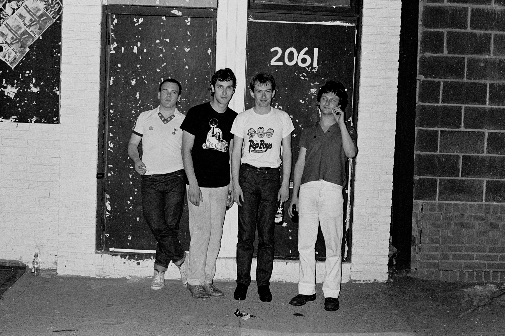
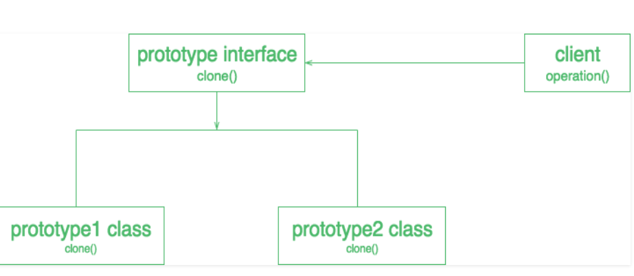

---

layout: essay

type: essay

title: One of the Gang

# All dates must be YYYY-MM-DD format!

date: 2021-11-30

labels:

- Software Engineering

- Design Patterns

- OOP

---

## What I Didn't Know I Knew

Design patterns as I have learned so far are simple in the fact that we subconsciously follow them even though we may not have been aware of their presence. The first design pattern I realized I had been using most recently was the [Singleton](https://en.wikipedia.org/wiki/Singleton_pattern). In my final project for ICS-314 I have made a few collections with mongo database where these collections are all of the same instance. This makes a lot of sense because it would seem pointless to have more than one database for each subscriber when the database requires similarity across all users. In my project I achieve this by having subscriptions and publications where any user of the app will access the same information (singleton of the database) but will only be able to see that which they are subscribed to or that in which their user role allows them to see. This simplifies code and storage requirements greatly as the app is designed around a fluid ever-changing database that behaves exactly unique to the user and what data they need to see.

### Model View Controller

"The Gang of Four" is a book with four authors approaching four design patterns named similar to a band called "Gang of Four". I am not sure whom inspired whom in this situation but that can be left as history. [MVC](https://www.geeksforgeeks.org/mvc-design-pattern/) design pattern I have noticed is similar to the reactive data we have been using in our project application. It allows for the data and what the user views to change in real time to reflect how the user interacts. This pattern lays down a set of guidelines that should be followed when programming as these guidelines hold across all different applications. In a sense, the user will manipulate a controller/controllers that manipulate the model of the application or program and in turn changes what the user sees. It seems to me as though if a program does not follow this design pattern, it would not work to begin with... but I see that it is very possible to obscure the overall goal of an application or program by losing sight of this model.

### Factories

Factories provide many different benefits, aside from polluting the environment. The way I first saw it was through the standard shape example. The shape factory could create a programmer defined combination of shapes without ever showing how the shape is made. If the user wanted a circle, they would get the best circle known to man but not know how they got it because factories allow for that to be "hidden". [This](https://www.tutorialspoint.com/design_pattern/factory_pattern.htm) is how I read about them and the same example was demonstrated in my Professor's screencast so in case you don't remember [this](https://www.tutorialspoint.com/design_pattern/factory_pattern.htm) is the common way to remember.

### Big Brother

With reactivity and responsive applications and programs, [observers](https://en.wikipedia.org/wiki/Observer_pattern) are often used when we don't often realize we are using them. In simple terms, observers will monitor the state of a program or section of one and look for something predetermined to change so the program can react. Observers seem comparable to loop invariants in that it decide when code needs to initiate/terminate. This goes way passed that level but observers are tools we use to look for changes in state or conditions.

### Clone Wars  

Prototypes are a nice tool that allows a client to "clone" an existing object rather than using a factory to create instances of new objects. My understanding is that this gives the programmer the ability to have prototypes for objects deemed necessary by the user in which they can create an instance of that object with preset variables that can be modified by the user rather than creating a new class. This makes it so the user will never see or receive the concrete code for the class of object they initiated but allows them to modify variables of the object as the programmer deemed fit. It took a moment for me to make a distinction between factories and prototypes but this [sketch](https://www.geeksforgeeks.org/prototype-design-pattern/) of prototypes vs. this [sketch](https://www.tutorialspoint.com/design_pattern/factory_pattern.htm) of factories helped me see a bit more clearly.

### Down to the Wire

Even though I personally enjoy Wire better than The Gang of Four, I have to say the reading on design patterns is illustrated very clearly but a little hard to wrap a head around. In my opinion, design patterns are subconsciously coded into most programs as they are concrete in there own right but, they are similar to QA in a sense that it is possible to make junk code when not following these preexisting design patterns. 

