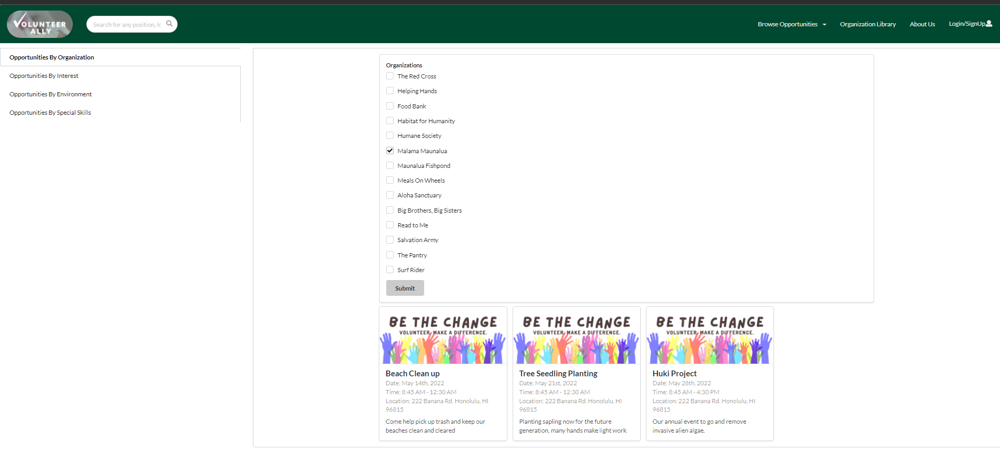

---

layout: essay

type: essay

title: Nonprofit Software Engineering

# All dates must be YYYY-MM-DD format!

date: 2022-05-09

labels:

- Software Engineering

- Social Media Interface

- Semantic UI with React

- React Share NPM

- Meteor

- Nonprofit

- Industrial Strength Meteor

- NoSQL Collections

---

<div class="ui large rounded images">

  

</div>

- [Intro](#the-goal)
- [Project Management](#agile-project-management)
- [Using Collections](#meteor-collections)
- [Building With Components](#building-with-components)
- [Github](#github)
- [Filtering Collections](#filtering-collections)
- [Human to Human Communications](#human-to-human-interfacing)
- [Customer Expectations](#customer-expectations)
- [Project Page and Code](#product-and-code)
- [Click Me to View Project Page](https://uh-manoa-meteorites.github.io/)


## The Goal

Volunteer Ally is a small nonprofit startup group that has a simple yet important vision: connecting the right volunteers with the right opportunities. Organizations have a volunteer representative which oversees posting, updating, and  verifying event information. Social Media applications have similar features, but Volunteer Ally seeks to remove all aspects that do not directly involve increasing overall volunteer hours in Hawaii. Each volunteer has a basic profile that serves as more of a dashboard for using the application, and the organization has a profile displaying general website information and communications options. Volunteers can add, share (on social media), and attend events where if an event is attended hours can be tracked as well. There was 3 months to complete the application (splitting time between other classes) but using good project management, the result is something we are proud of!

<div class="ui large images">

  

</div>

## Agile Project Management

Project Boards work well as they are a good way to track who is really doing what. Another benefit is that even if someone is not doing something, those tasks do not get forgotten about and eventually get picked up either way.

<div class="ui large images">

  

</div>

The projects boards prevented "double work" the whole semester, which is great because many times in group experiences, the same task will be completed twice. Excellent project management means that no matter the state of the project, work can be done on a specific issue without knowledge of anything else in the works. This is a powerful tool when correctly applied and I grow respect for it with each use.


## Meteor Collections

Using mongoDB for collections information was a learning experience. This project required a wide variety of collections whose access were granted by user roles. Organization/Volunteer/Admin profile collections, opportunity collections, and photo gallery collections store user information.  A lesson learned from this project is to spend more time in collections logic. Although the collections implemented for volunteer ally worked to meet the needs of final presented application, a better initial plan would have made the final push a little easier. There was not a lot of time to fully plan due to the dynamics and collections changing as the project evolved. Having a clear vision of the application is required earlier because as old logic roots itself deeper in the application code, the more difficult it becomes to remove. The application could have been much simpler in implementation (hindsight is always 20/20 vision) if 3 collections were used instead making for easier fetching of data. Here are some opportunity cards rendered from part of a collection:

<div class="ui large images">

  

</div>

Throughout this project I learned via lesson and struggle, the importance of having one or multiple collections for certain types of data. This lesson should project itself into all my future software engineering experiences or any endeavor involving database logic.

## Building with Components

Components become increasingly powerful the more they are used, or at least in my case. The formality of a component allows for schemas and databases to change, while still staying relevant to the initial information. The photo gallery component:

<div class="ui large images">

  

</div>

An organization may have completely different image needs or varying amounts of photos. A gallery is a simple way for organizations to store photos and display them easily, regardless of number. As data widens, properly constructed components are easy to modify and enhance. When a good component is built, it fills many areas within an application and is easy to place on any page of the application. Something as simple as changing the navbar color based on user role is easy but fulfilling. Things like this really make the application pop to the customer.

<div class="ui large images">

  

</div>
<div class="ui large images">

  

</div>
<div class="ui large images">

</div>
<div class="ui large images">

  

</div>

Components allow for extreme variability when carving desired differences between user experiences and the collection of user roles makes this possible.

## Github

Learning to use github has been quite a treat. It is not fool proof, but being able to preserve the state of the working application saved my team on multiple occasions. This project had numerous moving pieces making it difficult to determine when and where new code might affect something unrecognized to that team member. All in all, Github allows for team members to work on tasks simultaneously when correctly using Github thus allowing for Agile Project Management.

<div class="ui large images">

  

</div>

The above is an example of the working main for Volunteer Ally and sublist of all the all the different task branches that were worked on simultaneously throughout the project.

## Filtering Collections

Filtering the collections we had implemented was very challenging but equally as rewarding when complete. The filter page was one of the last tasks to be completed and involved finding specific characteristics within all collections.

<div class="ui large images">

  

</div>

The previous mention of importance of logic when designing the structure of collection was realized in this moment. Using what was there, it only required a few functions manipulating data-types back and forth through multiple collections eventually retrieving what was necessary. Looking back, a better way to do this would have better designed fewer collections and better structuring the schemas. This is a reasonable mistake as my team, and I were all learning throughout the project. Regardless, the filter page came out great and functioned as intended with a little extra effort.

<div class="ui large images">

  

</div>

The above filters volunteer opportunities by organization name and here is the code

```
const FilterOrganizations = ({ ready }) => {
const [organizations, setOrganizations] = useState([]);
const allOrganizations = _.pluck(OrganizationProfiles.find({}, {}).fetch(), 'organizationName');
const organizationFormSchema = makeOrganizationSchema(allOrganizations);
const organizationBridge = new SimpleSchema2Bridge(organizationFormSchema);
const organizationIDs = organizations.map(name => OrganizationProfiles.findDoc({ organizationName: name })._id);
console.log(organizationIDs);
const eventOrganizations = OrganizationEvent.find({ organizationID: { $in: organizationIDs } }, {}).fetch();
const eventIDList = _.uniq(eventOrganizations.map(eventOrganization => eventOrganization.eventID));
const eventsByOrganization = eventIDList.map(id => Events.findDoc(id));
console.log(eventOrganizations);
console.log(eventIDList);
console.log(eventsByOrganization);
const submitOrganizations = (data) => {
setOrganizations(data.organizations);
};

```

Having an array of opportunity IDs attached to each organization in the organization collection would have been much easier. For filtering the volunteer opportunities by interest, skill or environment type it would have been better to attach the applicable IDs to the opportunity document. Our implementation worked just fine but if I am ever part of up-scaling the project further I would redesign the collections as finding data would become slow as more opportunities are added.

## Human to Human Interfacing

While some enjoy the amenities of their own home in the past few years, we have missed out on real team member interaction. I really enjoyed being back with a team in person and interacting with others working towards the same goal. Physical interaction was a large benefit compared to my last project where nobody ever even saw each other (I could walk right passed an old team member and never even notice). I believe this to be a huge advantage when assigning tasks, determining strengths and weaknesses of team members, etc... I would not say this is a necessary thing, but inspiration can result from team members feeding off each other's momentum when executing tasks. My team formed a good bond, and there was never an issue of having each other's backs when someone was having a rough midterms week or rough week in general. Our weekly interaction kept us on track towards our goals and when one person was focused, we all were focused.

## Customer Expectations

Managing customer expectations was an interesting concept because of course any good developer wants to anything and everything to make an application its best. The customer has no concept of how difficult things are to implement and us as students were eager to develop. In the beginning it was easy to go down the rabbit hole of functionality within certain components far before they were even implemented. This in my opinion only distracted us from what was current and relevant. As the project widened and time furthered, it became easier to see what was manageable and what wasn't. This is ideal because being in a time sensitive environment (college) and managing these expectations will make for a much easier time doing so when it is the primary focus. Building a good relationship and staying firm but fair with the customer is a characteristic necessary for being a good software engineer.

## Product and Code

The final product will move forward to serve as a baseline to be furthered by classmates interning for Volunteer Ally this summer. Although the app is not currently deployed, the [app](https://github.com/uh-manoa-meteorites/nonprofit-project-template) can be downloaded and ran locally on any machine! The [user/developer guide](https://uh-manoa-meteorites.github.io/) where the functionality is well documented and the instructions for running on your machine! [The UH Manoa Meteorites](https://github.com/uh-manoa-meteorites) was a fun experience and something I know I will always remember.


