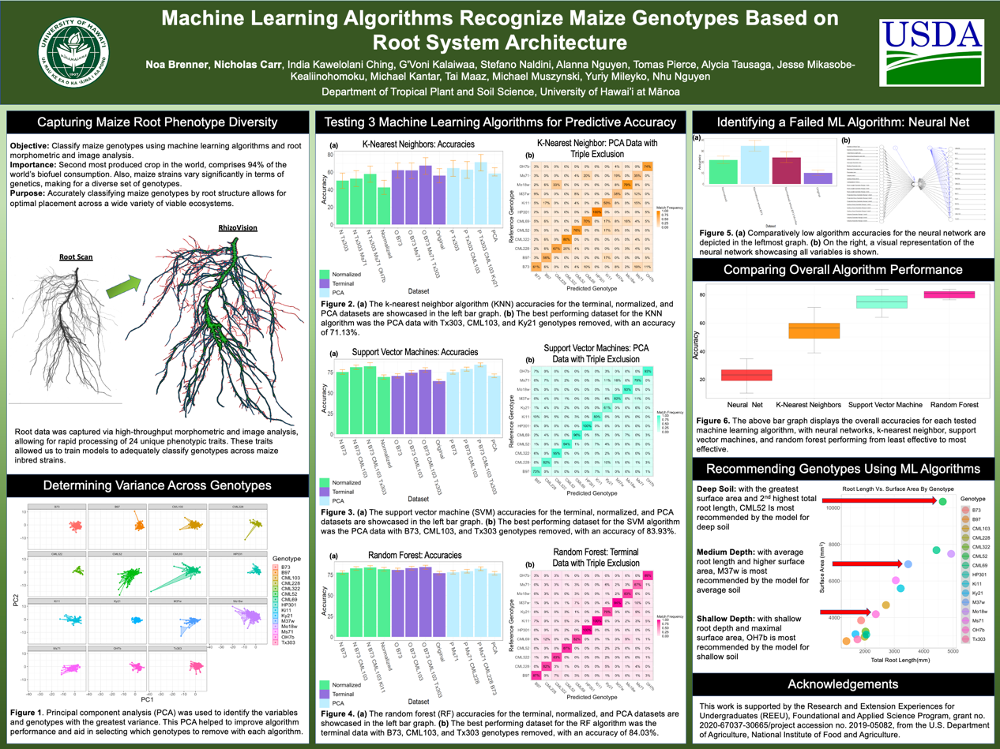

<div class="ui large rounded images">

  

</div>

An opportunity to learn and explore data science while gaining experience with machine learning algorithms. The above is the final poster that summarized what we did and how we achieved it.

A detailed version of the entire project can be seen here: [REEU Data Driven Agriculture](https://nicholasbcarr.github.io/essays/data-driven-agriculture.html)

Here is some code that illustrates how we read values from the line sensors:

```cpp
byte ADCRead(byte ch)
{
    word value;
    ADC1SC1 = ch;
    while (ADC1SC1_COCO != 1)
    {   // wait until ADC conversion is completed   
    }
    return ADC1RL;  // lower 8-bit value out of 10-bit data from the ADC
}
```

You can learn more at the [UH Micromouse News Announcement](https://manoa.hawaii.edu/news/article.php?aId=2857).
