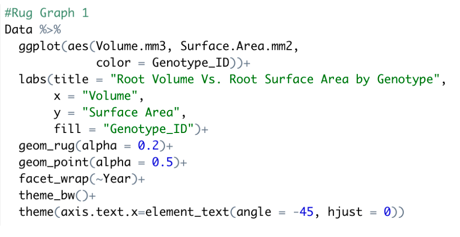
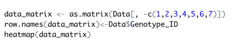

  

An opportunity to learn and explore data science while gaining experience with machine learning algorithms. The above is the final poster that summarized what we did and how we achieved it.

A detailed version of the entire project can be seen here: [REEU Data Driven Agriculture](https://nicholasbcarr.github.io/essays/data-driven-agriculture.html)

Here is some code that illustrates how we generated models after cleaning and processing the data we collected from growing our own maize genotypes:

  

  

The website for the entire research project: [REEU Data Driven Agriculture](https://cms.ctahr.hawaii.edu/reeu/).
