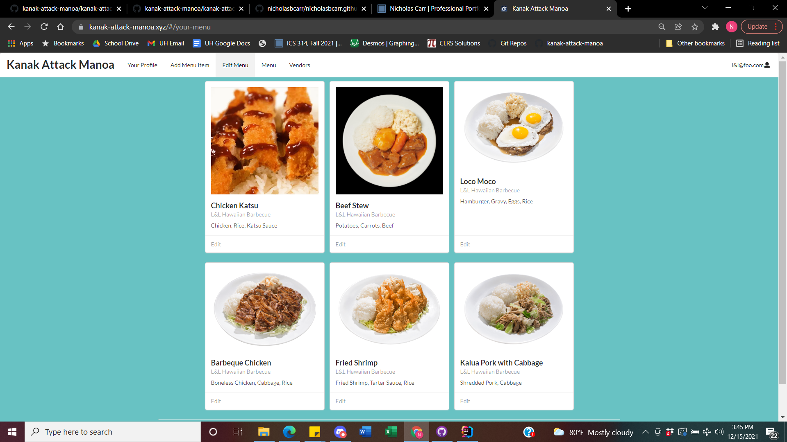
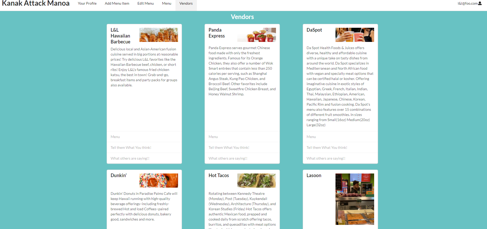

---

layout: project

type: project

image: img/food-project-cover.png

title: Kanak Attack Manoa (Food Discovery App)

permalink: projects/kanak-attack-manoa

# All dates must be YYYY-MM-DD format!

date: 2021-12-15

labels:

  - javaScript

  - Github

  - intelliJ

  - Semantic UI with React

  - Reactive Software Development

  - testCafe Testing Implementation

  - Project Management

  - Uniforms

summary: Working as a team we implemented a University of Hawaii at Manoa style grubHub app where students can create an account to browse food items from various vendors on campus. We also implemented a system where new vendors can create accounts to showcase their menu items and be reviewed by campus community members.

---

  

  - [Prelude](#prelude)
  - [Schemas](#schemas-where-everything-begins)
  - [Components](#components)
  - [Pages](#pages-the-visible-art)
  - [Pubs and Subs](#publications--subscriptions)
  - [Testing](#testing-and-improvements)
  - [Conclusion](#what-a-learning-experience)

## Prelude

This project put all of the concepts I had learned throughout my time studying computer science to the test. As a team of five, Kanak Attack Manoa, we used project management and Github as the root for our source code. This was my first group project involving software engineering and a team. This project was a lesson in team management and management of a techStack and source code. Not only did I learn a lot juicing up our app to exceed requirements of our project but I also learned of all the issues that can arise from many team members all differently changing the source code and how to fix them.

## Schemas, Where Everything Begins

  

Schemas are the recipes of life, they must be followed and they prevent things such as the sky falling or pigs flying. The schema is so simple but so powerful in that they are the first step towards sanity as a software engineer. Many times in the past, I have implemented programs that write/read data having to ensure I handle all input errors to prevent adding garbage to my database and dooming myself from the start. Having the correct information going into the database is nearly as important as well... the database. Pulling wrongly defined structures or objects from a database can break even the best of code, but the schema I have learned is a strong tool in preventing that. In my project, I used schema's to define vendor/menuItem/review objects similar in fashion to a struct in C. The beauty behind it though is that when using [schemas](https://techmonitor.ai/what-is/what-is-schema-4944519#:~:text=A%20schema%20in%20computer%20programming,or%20structure%20for%20a%20database.&text=Basically%20a%20schema%20is%20the,constraints%20imposed%20on%20a%20database.), errors get handled for you in a sense that the schemas, forms and functions will ensure that no bad data gets entered into the database. It makes sure all input data matches the schema before placing in the database saving time and effort for all. 

## Components

Components are the representation portals of the objects stored in a database when dealing with [Semantic UI with React](https://react.semantic-ui.com/). As seen in the image below, the vendor component illustrated is information pulled from the database and formatted on this card to visualize the information. My project had a few different components that have sole purpose of making raw data look nice.

  

Using components is a good way to organize code because no matter how you list/display/decorate the component, it will always represent the data in a correct manner. My favorite thing of all is that once you have a functioning component, it will never cease to function as it was designed.

## Pages, the Visible Art

Components are useless without a way for them to be displayed, enter pages. Pages are the tools that allow us to organize/list/filter/display components based on the overall goal of the page. [Design Patterns](https://nicholasbcarr.github.io/essays/gang-of-four.html) are subconsciously at play here. With the components already defined, pages are just rendering components in a way deemed fit by the programmer. It would be very possible to have no knowledge of the component code (aside from component properties) to design a page knowing only the types of components but not what they show exactly.

  

If somebody wanted to list all the vendors, all they would need their page to do is render all the vendor components. If someone wanted to see only certain types of vendors, it would be easy to filter components thus rendering only the ones applicable to the query. Super duper! This project was a lesson in code organization and I may have started out blind, but I can now see very clearly the benefits of this type of framework.

## Publications & Subscriptions

I enjoyed the concept of being able to control/filter/manage database information based on the type of role that limits or extends what someone with that role sees. In my opinion, it further helps organize code. I have not really dealt with this type of thing up until this point but it made things easy to split up and allowed for use of the same components. The best example in my project of a role based component is the navbar.

  

  

  

The navbar component remains unchanged but displays different data based upon the role the user has and what database subscriptions they have access to. This means that there are no different navbar components, just one that adapts to the users role.

## Testing, and Improvements

Using testCafe was a new experience to me as well, but the API for it is reasonable to understand and makes it fairly easy to recreate a full user experience for each user role. This is where I found we had named some of our components and pages extremely confusing names, I was guilty of this as well. Testing was established about 75% of the way through our project, but I wish I could have done it earlier. Even though there was not enough time to fix all the little confusing terms, I learned a lot working through the code with test functions and often finding certain things were not actually behaving how we all thought. Testing was fun to implement because you essentially just created functions that simulate what each user/vendor/admin role might have to do. This lead to finding little bugs and easy little fixes along the way, it also gave me an opportunity to examine and understand the code that other team members wrote.

## What a Learning Experience

Working with a team is both difficult and rewarding, especially in a school environment in which no schedule imaginable is abnormal. This project not only expanded my knowledge of programming and making it visual but also a learning experience of programming with a team. I think it takes just as much practice to be a good programmer as it does to be a good team member. I walk away from this project feeling pretty good about what i personally accomplished, but also feeling good about all the mistakes both corrected and uncorrected as they will help me in the future next time I am in this same scenario. Github also improved its worth with me by the end as I really learned how to work it and use it as a tool saving me more times than... you know, the other thing.

Here is a link to my deployed project: [Ics-314, Kanak Attack Manoa](https://kanak-attack-manoa.xyz/#/)

