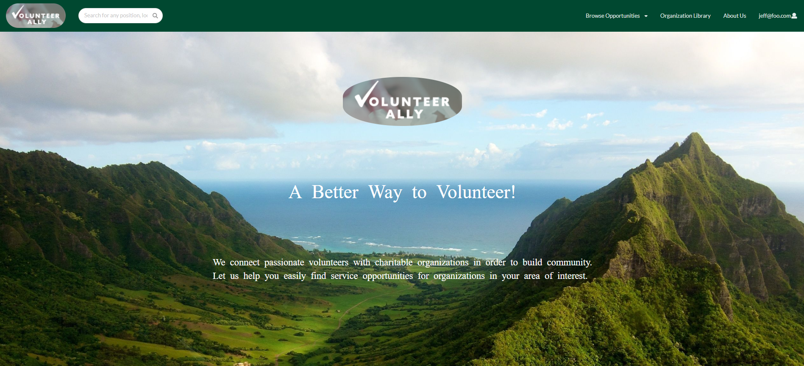

---

layout: project

type: project

image: img/volunteer-project-cover.png

title: Volunteer Ally

permalink: projects/volunteer-ally

# All dates must be YYYY-MM-DD format!

date: 2022-05-11

labels:

  - javaScript

  - Github

  - intelliJ

  - Semantic UI with React

  - Reactive Software Development

  - testCafe Testing Implementation

  - Project Management

  - Industrial Strength Meteor

  - Nonprofit

summary: Working as a team we implemented a volunteer-organization interface with the overall purpose of increasing volunteer hours in Hawaii.

---

  

  - [View/Download the App](#application-userdeveloper-guide)
  - [Project Summary](#summary-of-my-experience)

## Application User/Developer Guide

This is the link to the user guide I created for the web application we created for Volunteer Ally, it is not currently deployed due to further implementations but can be installed and locally on any machine! [Volunteer Ally Guide](https://uh-manoa-meteorites.github.io/)

## Summary of My Experience

This was my first project working for an actual organization and using the abilities I have learned so far to implement the vision of another person. Here is a summary of my experience with the class and project! [Volunteer Ally Project Summary](https://nicholasbcarr.github.io/essays/the_nonprofit_software_engineer.html)

